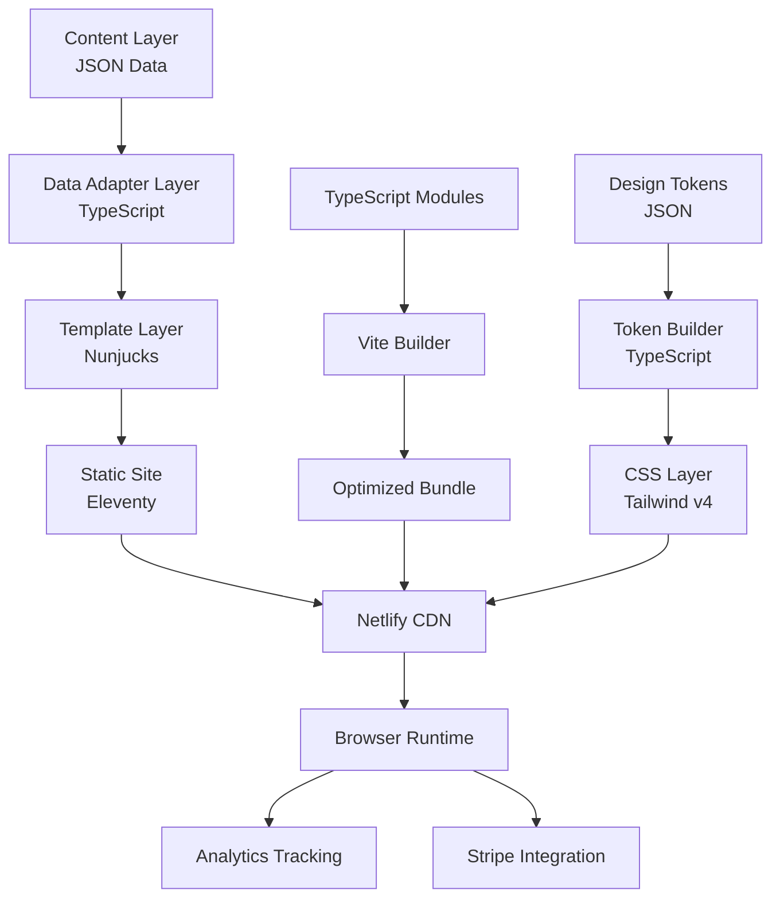
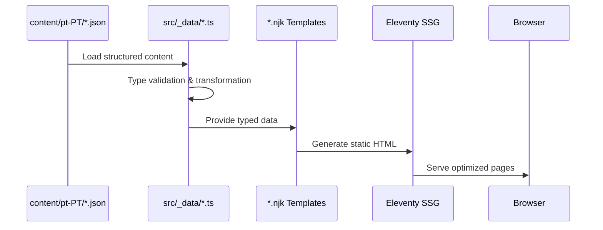
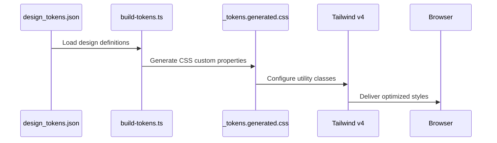
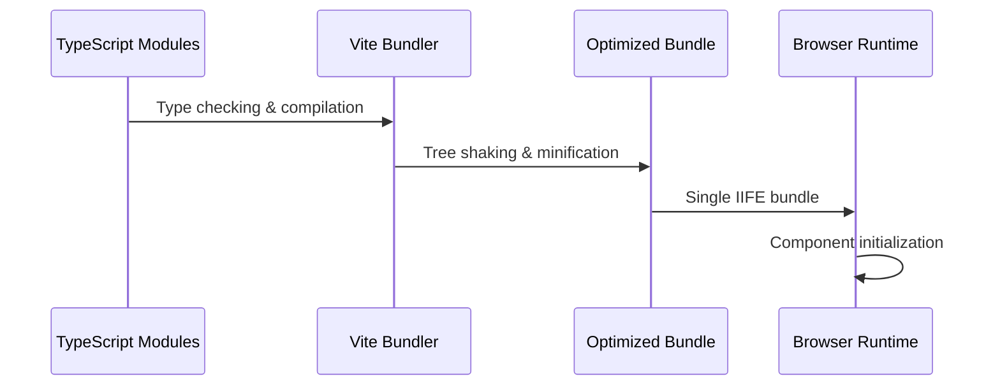
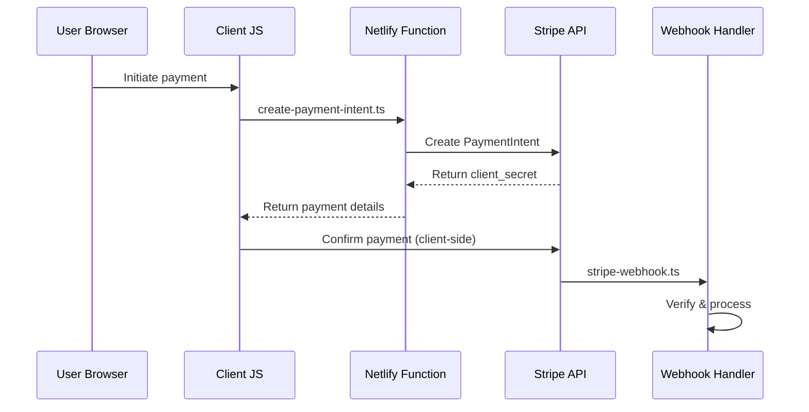
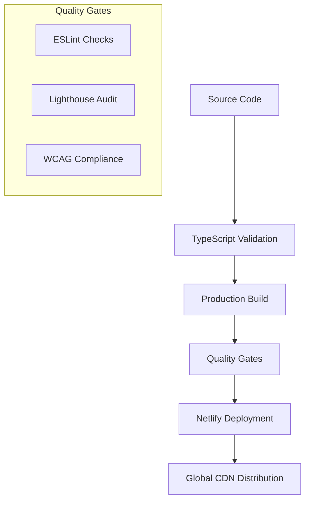

# Architecture Overview

> **High-Level System Architecture for Café com Vendas**
>
> A comprehensive map of the TypeScript-first, performance-optimized landing page architecture designed for conversion and maintainability.

## 🎯 System Overview

**Purpose**: Premium event landing page for female entrepreneurs (September 20, 2025, Lisbon)  
**Architecture**: TypeScript-first modular architecture with type safety  
**Language**: Portuguese (pt-PT) with i18n-ready structure  
**Goal**: High-converting, elegant design with proven conversion principles  

### Key Metrics
- **TypeScript Coverage**: 100% file coverage (45 type errors being resolved)
- **Performance Target**: Lighthouse >90
- **Accessibility Target**: WCAG 2.1 AA compliance (>95)
- **Bundle Size**: <100KB JavaScript gzipped, <50KB CSS
- **Component Architecture**: Platform UI library with reusable patterns

## 🏗️ High-Level Architecture



## 📂 Directory Structure Map

```
📦 Project Root
├── 🌍 content/pt-PT/           # Content Source (i18n-ready)
│   ├── design_tokens.json     # Design system definitions
│   ├── site.json              # Global site metadata
│   ├── event.json             # Event data & pricing
│   ├── avatar.json            # Customer persona
│   ├── faq.json               # FAQ content
│   └── testimonials.json      # Social proof data
│
├── 🗃️ src/_data/               # Data Adapter Layer (TypeScript)
│   ├── site.ts                # Site metadata loader
│   ├── event.ts               # Event data loader
│   ├── tokens.ts              # Design tokens loader
│   └── *.ts                   # Type-safe data adapters
│
├── 🎨 src/_includes/           # Template Layer
│   ├── layout.njk             # Base HTML template
│   ├── sections/              # Co-located Sections
│   │   ├── hero/
│   │   │   ├── index.njk      # Hero template
│   │   │   └── index.ts       # Hero logic (TypeScript)
│   │   ├── offer/             # Same pattern for all sections
│   │   └── */                 # Modular section architecture
│   └── sections-legacy/       # Legacy components (templates only)
│
├── ⚡ src/assets/js/           # TypeScript Architecture
│   ├── main.ts                # Application entry point
│   ├── app.ts                 # Application controller
│   ├── types/                 # Type definitions
│   │   ├── global.ts          # Global types
│   │   ├── component.ts       # Component interfaces
│   │   └── *.ts               # All type definitions
│   ├── core/
│   │   ├── analytics.ts       # GTM/GA4 tracking
│   │   └── state.ts           # State management
│   ├── utils/
│   │   ├── dom.ts             # DOM helpers
│   │   ├── animations.ts      # Animation utilities
│   │   └── index.ts           # Utils barrel export
│   └── components/
│       ├── banner.ts          # Top banner
│       ├── faq.ts             # FAQ accordion
│       ├── gtm.ts             # Google Tag Manager
│       └── *.ts               # All components in TypeScript
│
├── 🎨 src/assets/css/          # Styling Layer
│   ├── main.css               # Tailwind + tokens entry
│   └── _tokens.generated.css  # Generated from JSON tokens
│
├── 🏗️ src/platform/           # Platform Foundation
│   ├── lib/utils/             # Shared utilities
│   ├── analytics/core/        # Analytics abstraction
│   └── ui/components/         # UI component library
│
├── ☁️ netlify/                # Serverless Functions
│   ├── functions/
│   │   ├── create-payment-intent.ts  # Stripe payments
│   │   ├── stripe-webhook.ts         # Stripe webhooks
│   │   └── mailerlite-lead.ts        # Email integration
│   └── edge-functions/
│       └── csp.ts             # Content Security Policy
│
├── 🔧 scripts/                # Build Tools
│   ├── build-tokens.ts        # Design tokens → CSS
│   ├── universal-screenshot.ts # Screenshot system
│   └── *.ts                   # All build scripts in TypeScript
│
├── 📋 docs/                   # Documentation
│   ├── coding-standards.md    # Development standards
│   ├── architecture-overview.md # This document
│   └── *.md                   # Technical documentation
│
└── ⚙️ Configuration Files
    ├── .eleventy.ts           # Eleventy config (TypeScript)
    ├── vite.config.ts         # Vite bundler config
    ├── tsconfig.json          # TypeScript configuration
    ├── eslint.config.ts       # ESLint config
    └── postcss.config.ts      # PostCSS config
```

## 🔄 Data Flow Architecture

### Content to Display Pipeline


### Design System Pipeline


### JavaScript Build Pipeline


## 🧩 Component Architecture

### Platform UI Components (New Pattern)
```typescript
// src/platform/ui/components/accordion.ts
export class Accordion implements UIComponent {
    private container: HTMLElement;
    
    constructor(container: HTMLElement) {
        this.container = container;
    }
    
    init(): void {
        this.bindEvents();
    }
    
    private bindEvents(): void {
        // Type-safe event delegation
    }
}
```

### Co-located Sections (Modern Pattern)
```typescript
// src/_includes/sections/hero/index.ts
export const HeroSection: Component = {
    init(): void {
        this.bindEvents();
        // Make methods globally available for onclick handlers
        const global = window as typeof window & {
            scrollToOffer: () => void;
        };
        global.scrollToOffer = this.scrollToOffer.bind(this);
    },
    
    bindEvents(): void {
        // Component-specific event handling
    },
    
    scrollToOffer(): void {
        // Type-safe DOM manipulation with Tailwind classes
    }
};
```

### Legacy Components (Transitional Pattern)
```typescript
// src/platform/ui/components/faq.ts
import type { Component } from '../types/component.js';

export const FAQ: Component = {
    init(): void {
        this.bindEvents();
        (window as any).toggleFAQ = this.toggle.bind(this);
    },
    
    toggle(questionId: string): void {
        // Pure Tailwind class manipulation
        const answer = document.getElementById(questionId);
        if (!answer) return;
        
        answer.classList.toggle('hidden');
        answer.classList.toggle('max-h-0');
        answer.classList.toggle('max-h-96');
    }
};
```

## 🎨 Styling Architecture

### Design Token System
```json
// design/tokens.json
{
  "colors": {
    "navy": {
      "50": "#f0f2f5",
      "600": "#1a365d",
      "900": "#0a1628"
    },
    "burgundy": {
      "50": "#fdf2f8",
      "500": "#be185d",
      "900": "#581c34"
    }
  }
}
```

### CSS Generation Process
```css
/* Generated: src/assets/css/_tokens.generated.css */
:root {
  --color-navy-50: #f0f2f5;
  --color-navy-600: #1a365d;
  --color-burgundy-500: #be185d;
}

/* Usage in Tailwind v4 */
@theme {
  --color-navy-50: var(--color-navy-50);
  --color-navy-600: var(--color-navy-600);
  --color-burgundy-500: var(--color-burgundy-500);
}
```

### Tailwind Utility Generation
```html
<!-- Available utility classes -->
<div class="bg-navy-600 text-burgundy-500 hover:bg-navy-700">
  <!-- Pure utility-based styling -->
</div>
```

## 💳 Payment Processing Architecture

### Stripe Integration Flow


### Security Architecture
- **Client-side**: Only public keys and payment confirmation
- **Server-side**: All sensitive operations in Netlify functions
- **Webhook Validation**: Stripe signature verification
- **Environment Variables**: Secure secret management

## 📊 Analytics Architecture

### Tracking System
```typescript
// src/core/analytics.ts
interface AnalyticsEvent {
    readonly event_name: string;
    readonly section: string;
    readonly element_type: string;
    readonly element_text?: string;
}

class Analytics {
    track(event: AnalyticsEvent): void {
        // GTM/GA4 event tracking with type safety
    }
}
```

### Data Layer Structure
```javascript
// Generated GTM data layer
window.dataLayer = window.dataLayer || [];
window.dataLayer.push({
    event: 'section_view',
    section: 'hero',
    element_type: 'section_entry',
    page_language: 'pt-PT'
});
```

## 🚀 Build & Deployment Architecture

### Development Workflow
```bash
# 1. Token Generation
npm run tokens:build  # JSON → CSS custom properties

# 2. CSS Build
npm run build:css     # Tailwind processing with PostCSS

# 3. TypeScript Build
npm run build:js      # Vite bundling with type checking

# 4. Static Site Generation
npm run build         # Eleventy processes templates with data
```

### Production Pipeline


### Performance Optimizations
- **Tree Shaking**: Dead code elimination via Vite
- **CSS Purging**: Unused Tailwind utilities removed
- **Image Optimization**: WebP format with lazy loading
- **Font Loading**: Local fonts with font-display: swap
- **Bundle Splitting**: Optimal chunk sizes for caching

## 🔐 Security Architecture

### Content Security Policy
```typescript
// netlify/edge-functions/csp.ts
const csp = [
    "default-src 'self'",
    "script-src 'self' https://js.stripe.com https://www.googletagmanager.com",
    "style-src 'self' 'unsafe-inline'",
    "img-src 'self' data: https:",
    "connect-src 'self' https://api.stripe.com"
].join('; ');
```

### Security Measures
- **HTTPS Enforcement**: Netlify automatic SSL
- **Environment Variables**: Never exposed client-side
- **Payment Security**: PCI DSS compliance via Stripe
- **Input Validation**: Type-safe data processing
- **XSS Prevention**: CSP headers and template escaping

## 🧪 Testing Architecture

### Type Safety Validation
```typescript
// scripts/verify-apis.ts
import type { ComponentConfig } from '../src/assets/js/types/config.js';

// Compile-time API validation
const testConfig: ComponentConfig = {
    containerId: 'test',
    autoInit: false
};
```

### Quality Gates
- **TypeScript Compilation**: Working towards zero errors (45 remaining)
- **ESLint**: Code quality and consistency
- **Lighthouse**: Performance and accessibility metrics
- **Build Validation**: Successful production build
- **Type Coverage**: 100% file coverage, resolving edge cases

## 📱 Responsive Architecture

### Breakpoint Strategy
```css
/* Tailwind responsive utilities */
.hero-title {
  @apply text-2xl md:text-4xl lg:text-6xl;
  @apply leading-tight md:leading-relaxed;
}
```

### Mobile-First Design
- **Progressive Enhancement**: Base styles for mobile
- **Touch Interactions**: Optimized button sizes (44px minimum)
- **Performance**: Prioritized mobile performance metrics
- **Accessibility**: Touch and keyboard navigation support

## 🔧 Development Tools Integration

### IDE Configuration
- **TypeScript Language Server**: Full IntelliSense support
- **ESLint Integration**: Real-time code quality feedback
- **Prettier**: Consistent code formatting
- **Tailwind IntelliSense**: CSS class auto-completion

### Development Server
```bash
npm run dev  # Concurrent development processes:
# - Token building (watch mode)
# - CSS compilation (watch mode)  
# - TypeScript compilation (watch mode)
# - Eleventy server (watch mode)
```

## 📈 Monitoring & Analytics

### Performance Monitoring
- **Core Web Vitals**: LCP, FID, CLS tracking
- **Lighthouse CI**: Automated performance audits
- **Bundle Analysis**: Size tracking and optimization
- **Error Tracking**: Runtime error monitoring

### Business Analytics
- **Conversion Tracking**: Purchase funnel analysis
- **User Behavior**: Scroll depth, section engagement
- **A/B Testing**: Copy and design variation testing
- **Attribution**: Traffic source and campaign tracking

## 🔄 Maintenance & Updates

### Dependency Management
```bash
npm run versions     # Check current versions
npm run outdated     # Check for updates
/version-check       # Claude command for version validation
/update-libs         # Claude command for safe updates
```

### Documentation Maintenance
- **Automated Updates**: Version-aware documentation
- **Architecture Decisions**: Recorded in docs/
- **API Changes**: Breaking change documentation
- **Migration Guides**: Version upgrade instructions

## 🆕 Recent Architecture Changes

### December 2024 Updates
- **Platform UI Library**: Added `src/platform/ui/components/` for reusable UI patterns
- **TypeScript Migration**: Achieved 100% file coverage, resolving remaining type errors
- **Data Consolidation**: Unified data loaders into cohesive page system
- **Component Architecture**: Enhanced separation between platform and application components
- **Type Safety**: Improved error handling with `unknown` types and proper null checks

---

**Last Updated**: December 2024  
**Architecture Version**: 2.1 (TypeScript-First with Platform UI)  
**Maintainer**: Development Team  
**Next Review**: January 2025