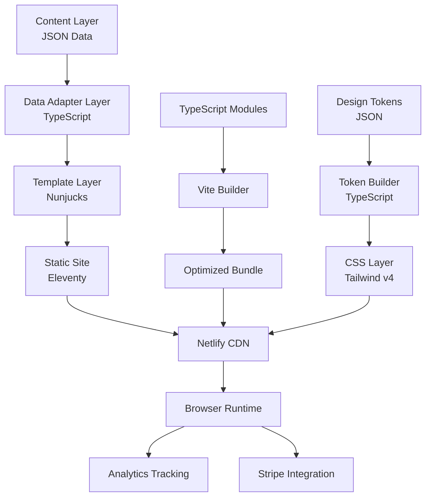
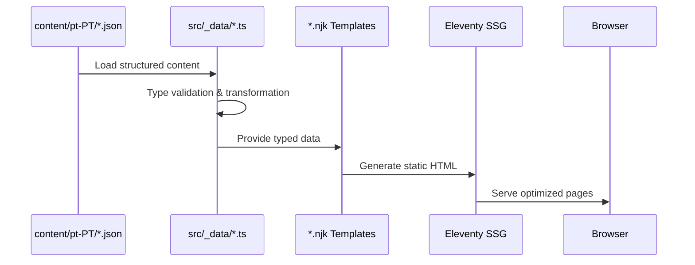
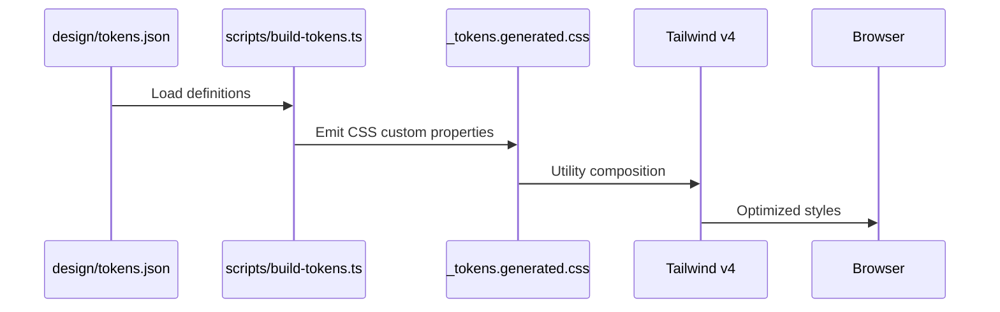
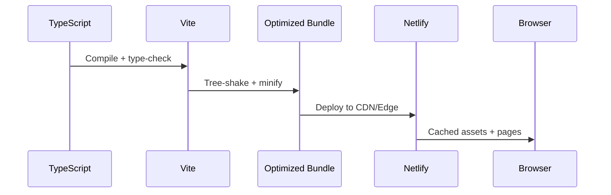

# Architecture Overview — Café com Vendas

> High‑level system map for a **TypeScript‑first**, performance‑optimized landing page designed for conversion and maintainability. This document is concise by design and defers deep details to the linked docs.

---

## 🎯 System Overview

**Purpose**: Premium event landing page for female entrepreneurs in Lisbon
**Architecture**: TypeScript‑first modular SSG with strict styling and analytics conventions
**Language**: Portuguese (pt‑PT), i18n‑ready
**Goal**: High‑converting, elegant design grounded in proven UX + performance

### Key Metrics (source of truth: README)

* **TypeScript Coverage**: 100% file coverage (**0 type errors**)
* **Performance Target**: Lighthouse ≥ 90 (mobile), ≥ 90 (desktop)
* **Accessibility Target**: WCAG 2.1 AA, Lighthouse A11y ≥ 95
* **Bundle Size**: JS < 100 KB gzip (goal), CSS < 50 KB gzip
* **First Party Code Rules**: TS‑only, Tailwind‑only, tokenized design

### Core Principles

* **TS‑only**: no `.js` sources; **imports use `.js` extensions** (ESM TS emit)
* **Tailwind v4 only**: CSS‑first `@theme`; no `tailwind.config.js`; no inline styles
* **Design Tokens**: JSON → build → CSS custom properties
* **Security**: strict CSP; no inline scripts/handlers; typed analytics helpers
* **Performance**: lazy‑load third‑party (e.g., Stripe), small bundles, optimized images
* **Analytics**: normalized dataLayer; **`payment_completed` → GA4 `purchase`** (see GTM docs)

---

## 🏗️ High‑Level Architecture



---

## 📂 Directory Structure (concise)

```
📦 Project Root
├─ content/pt-PT/           # i18n content (site, event, pages, sections, strings)
│  └─ design_tokens.json
├─ design/tokens.json       # Design tokens (source of truth)
├─ src/
│  ├─ _data/                # Type‑safe data adapters (TS)
│  ├─ _includes/            # Nunjucks templates + sections (co‑located {index.njk,index.ts})
│  ├─ assets/
│  │  ├─ css/               # Tailwind + generated tokens CSS
│  │  └─ js/                # TS entry + core + types + config
│  ├─ platform/             # Platform foundation (utils, UI components)
│  └─ pages/                # Page templates (index, legal, thank‑you)
├─ netlify/
│  ├─ functions/            # Stripe, MailerLite, webhooks (TS)
│  └─ edge-functions/       # CSP headers (TS)
├─ scripts/                 # Build tools (tokens, scaffolds) (TS)
├─ docs/                    # Architecture, standards, setup guides
└─ config files             # .eleventy.ts, vite.config.ts, tsconfig.json, etc.
```

> Full map with file examples lives in the README and section docs. This overview avoids duplication to stay current.

---

## 🔄 Data Flow

### Content → Display



### Design System Pipeline



### Build & Runtime



---

## 🧩 Component Architecture

### Platform UI Components (example, TS)

```ts
// src/platform/ui/components/accordion.ts
export class Accordion {
  constructor(private container: HTMLElement) {}
  init(): void {
    this.container.addEventListener('click', (e: Event) => {
      const t = e.target as HTMLElement;
      if (t?.matches('[data-accordion-trigger]')) this.toggle(t);
    });
  }
  private toggle(trigger: HTMLElement): void {
    const content = trigger.nextElementSibling as HTMLElement | null;
    content?.classList.toggle('hidden'); // Tailwind‑only state change
  }
}
```

### Co‑located Sections (modern pattern)

```ts
// src/_includes/sections/hero/index.ts
export const HeroSection = {
  init(): void {
    (window as typeof window & { scrollToOffer: () => void }).scrollToOffer =
      this.scrollToOffer.bind(this);
  },
  scrollToOffer(): void {
    // Type‑safe DOM ops, Tailwind classes only
    document.getElementById('offer')?.scrollIntoView({ behavior: 'smooth' });
  }
};
```

---

## 🎨 Styling

* **Tailwind v4** (CSS‑first): tokens → generated CSS → utilities
* **No inline styles**; mutate state via classList only
* **Fonts**: self‑hosted; `font-display: swap`
* **Critical CSS**: above‑the‑fold inlined by build where applicable

---

## 📈 Analytics & Events

* **GTM/GA4** with normalized dataLayer
* Canonical event naming: **`payment_completed`** in dataLayer, mapped to GA4 **`purchase`**
* See: `docs/GTM_CONFIGURATION_REFERENCE.md` and `docs/GTM_SETUP_GUIDE.md`

---

## 🔒 Security & Privacy

* Strict **CSP**; no inline scripts/handlers
* Avoid direct DOM injection; sanitize external inputs
* Stripe loaded **on demand** (purchase intent only)

---

## ✅ Quality Gates (must pass before merge)

* `npm run type-check` → **0 errors**
* `npm run lint` → **0 errors**
* Tests (unit/e2e/visual) green when applicable
* Lighthouse: Perf ≥ 90, A11y ≥ 95, Best‑Practices 100 on key pages

---

## 📚 Linked References (single sources of truth)

* **README.md** — canonical versions, quick start, full file map
* **docs/coding-standards.md** — TS‑only, Tailwind‑only rules
* **docs/ACCESSIBILITY\_GUIDELINES.md** — a11y rules & checklists
* **docs/GTM\_CONFIGURATION\_REFERENCE.md** — events & payloads
* **docs/GTM\_SETUP\_GUIDE.md** — container setup & GA4 mapping
* **docs/CLOUDINARY\_SETUP.md** — responsive images pipeline

---

*Last updated: 2025‑08‑22*
