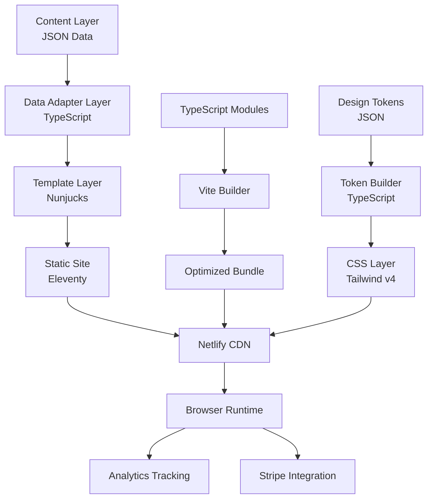
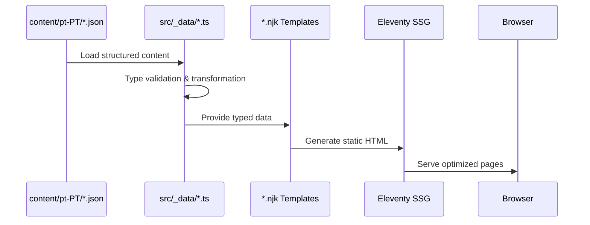
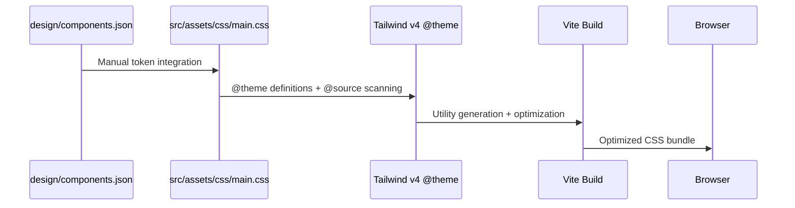
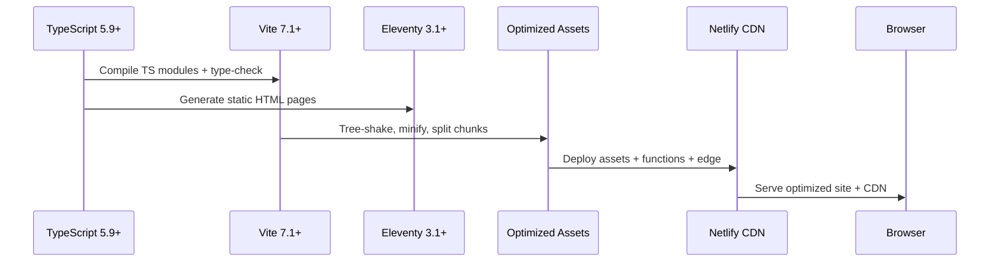

# Architecture Overview — Café com Vendas

> High‑level system map for a **TypeScript‑first**, performance‑optimized landing page designed for conversion and maintainability. This document is concise by design and defers deep details to the linked docs.

---

## 🎯 System Overview

**Purpose**: Premium event landing page for female entrepreneurs in Lisbon
**Architecture**: TypeScript‑first modular SSG with strict styling and analytics conventions
**Language**: Portuguese (pt‑PT), i18n‑ready
**Goal**: High‑converting, elegant design grounded in proven UX + performance

### Key Metrics (source of truth: README)

* **TypeScript Coverage**: 100% file coverage (**0 type errors**)
* **Performance Target**: Lighthouse ≥ 90 (mobile), ≥ 90 (desktop)
* **Accessibility Target**: WCAG 2.1 AA, Lighthouse A11y ≥ 95
* **Bundle Size**: JS < 100 KB gzip (goal), CSS < 50 KB gzip
* **First Party Code Rules**: TS‑only, Tailwind‑only, tokenized design

### Core Principles

* **TS‑first**: primarily `.ts` sources; **imports use `.js` extensions** (ESM TS emit)
* **Tailwind v4 only**: CSS‑first `@theme`; no `tailwind.config.js`; no inline styles
* **Design Tokens**: embedded in CSS `@theme` block (no JSON build pipeline)
* **Security**: strict CSP via edge functions; no inline scripts/handlers; typed analytics
* **Performance**: lazy‑load third‑party (Stripe), Vite 7.x optimizations, modern targets
* **Testing**: unit (Vitest), visual (Playwright), schema validation
* **Analytics**: normalized dataLayer; **`payment_completed` → GA4 `purchase`** (see GTM docs)

---

## 🏗️ High‑Level Architecture



---

## 📂 Directory Structure (concise)

```
📦 Project Root
├─ src/
│  ├─ _data/                # Type‑safe data adapters and content
│  │  └─ sections-data/     # Section JSON content files
│  ├─ _includes/            # Nunjucks templates + sections (co‑located {index.njk,index.ts})
│  │  ├─ partials/          # Reusable template components
│  │  └─ sections/          # Page sections with schema (all with schema.ts)
│  ├─ assets/
│  │  ├─ css/               # Tailwind v4 CSS-first with @theme tokens
│  │  └─ js/                # TS modules (main.ts, app.ts, config/, core/, utils/)
│  ├─ components/           # Component foundation
│  │  └─ ui/                # Reusable UI components (accordion, animations, analytics, thank-you)
│  ├─ pages/                # Page templates (index, legal, thank‑you)
│  ├─ public/               # Static assets
│  │  ├─ fonts/             # Web fonts (CenturyGothic, Lora)
│  │  ├─ images/            # All images (consolidated)
│  │  └─ favicon.ico        # Site favicon
│  └─ types/                # All TypeScript type definitions
├─ netlify/
│  ├─ functions/            # Serverless functions (Stripe, MailerLite, webhooks)
│  └─ edge-functions/       # Edge functions (CSP headers)
├─ scripts/                 # Build and utility scripts (validation)
├─ tests/                   # Test suites (unit, visual, schemas)
├─ docs/                    # Architecture, standards, setup guides
└─ config files             # .eleventy.ts, vite.config.ts, tsconfig.json, etc.
```

> Full map with file examples lives in the README and section docs. This overview avoids duplication to stay current.

---

## 🔄 Data Flow

### Content → Display



### Design System Pipeline



### Build & Runtime



---

## 🧩 Component Architecture

### Platform UI Components (example, TS)

```ts
// src/components/ui/accordion/index.ts
export const PlatformAccordion = {
  initializeNative(config: AccordionConfig): void {
    const container = safeQuery(config.containerSelector);
    const items = safeQueryAll(config.itemSelector) as NodeListOf<HTMLDetailsElement>;

    // Setup native <details> accordion behavior with animations
    items.forEach((item) => {
      item.addEventListener('toggle', () => {
        const isOpen = item.open;
        
        // Close others if not allowing multiple
        if (isOpen && !config.allowMultiple) {
          items.forEach((other) => {
            if (other !== item && other.open) other.open = false;
          });
        }
        
        // Call custom toggle handler (e.g., analytics)
        config.onToggle?.(item, isOpen);
      }, { passive: true });
    });
  }
};
```

### Co‑located Sections (modern pattern)

```ts
// src/_includes/sections/hero/index.ts
export const Hero = {
  init() {
    this.initAnimations();
    this.initInteractions();
    this.initScrollIndicator();
    this.initWhatsAppButton();
  },
  
  initAnimations() {
    const heroSection = safeQuery('#s-hero');
    const elements = [/* hero elements */].filter(Boolean);
    
    PlatformAnimations.prepareRevealElements(elements);
    const observer = PlatformAnimations.createObserver({
      callback: () => PlatformAnimations.revealElements(elements),
      once: true
    });
    observer.observe(heroSection);
  }
};
```

---

## 🎨 Styling

* **Tailwind v4** (CSS‑first): `@theme` tokens embedded in main.css → utilities
* **No inline styles**; mutate state via classList only
* **Fonts**: self‑hosted in src/public/fonts/; `font-display: swap`
* **Design tokens**: manually integrated into CSS `@theme` block (no JSON pipeline)
* **Source scanning**: `@source` directive tells Tailwind where to find utility usage

---

## 📈 Analytics & Events

* **GTM/GA4** with normalized dataLayer
* Canonical event naming: **`payment_completed`** in dataLayer, mapped to GA4 **`purchase`**
* See: `docs/GTM_CONFIGURATION_REFERENCE.md` and `docs/GTM_SETUP_GUIDE.md`

---

## 🔒 Security & Privacy

* Strict **CSP**; no inline scripts/handlers
* Avoid direct DOM injection; sanitize external inputs
* Stripe loaded **on demand** (purchase intent only)

---

## ✅ Quality Gates (must pass before merge)

* `npm run type-check` → **0 errors** (TypeScript 5.9+)
* `npm run lint` → **0 errors** (ESLint 9+ with flat config)
* `npm run test:all` → all tests pass (Vitest unit + Playwright visual)
* Lighthouse: Perf ≥ 90 (mobile), A11y ≥ 95, Best‑Practices 100 on key pages
* Functions deploy successfully (Netlify dev + build)

---

## 📚 Linked References (single sources of truth)

* **README.md** — canonical versions, quick start, full file map
* **docs/coding-standards.md** — TS‑only, Tailwind‑only rules
* **docs/ACCESSIBILITY\_GUIDELINES.md** — a11y rules & checklists
* **docs/GTM\_CONFIGURATION\_REFERENCE.md** — events & payloads
* **docs/GTM\_SETUP\_GUIDE.md** — container setup & GA4 mapping
* **docs/CLOUDINARY\_SETUP.md** — responsive images pipeline

---

*Last updated: 2025‑08‑23*
